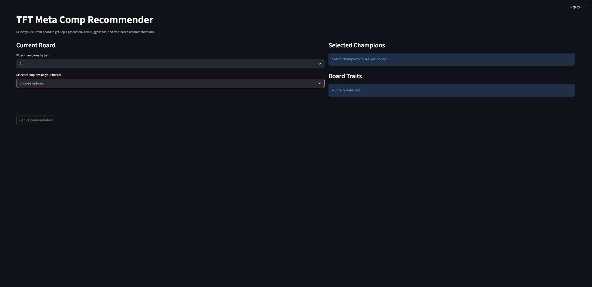

# TFT Meta Comp Recommender

An ML-powered tool that helps Teamfight Tactics players make smarter board decisions. Select your current champions and get Top-4 probability predictions, trait and item recommendations mined from ranked match data, and natural language coaching from LLaMA 3.2.

---

## Demo



---

## Features

- **ML Prediction** — Random Forest classifier predicts Top-4 probability from selected champions and inferred traits
- **Trait Recommendations** — High-performing traits ranked by Top-4 rate from real match data
- **Item Recommendations** — Common item patterns used by Top-4 players for each champion
- **AI Coaching** — LLaMA 3.2 generates short coaching explanations for the selected board

---

## Tech Stack

| Layer | Tool |
|------|------|
| Language | Python |
| Data Source | Riot TFT API |
| Static Metadata | Riot Data Dragon |
| Data Processing | Pandas, NumPy |
| Machine Learning | Scikit-learn, Random Forest |
| Generative AI | LLaMA 3.2 via Ollama |
| Database | SQLite |
| UI | Streamlit |

---

## How It Works

```text
Player selects current champions
            ↓
App infers active traits from selected champions
            ↓
Random Forest model predicts Top-4 probability
            ↓
Match data is mined for top traits and item patterns
            ↓
LLaMA 3.2 generates a coaching explanation
            ↓
Results are displayed in the Streamlit dashboard
```

---

## Project Structure

```text
tft-recommender/
├── app.py
├── data/
│   ├── fetch_data.py         # Riot API match data collection
│   ├── process_data.py       # Feature engineering for ML
│   ├── static_data.py        # Data Dragon metadata and icon mapping
│   ├── champions.py          # Champion and trait metadata helpers
│   └── static/
│       ├── asset_maps.json   # Icon URL mappings
│       ├── champions.json    # Champion metadata
│       ├── name_maps.json    # API name to display name mappings
│       └── traits.json       # Trait metadata
├── ml/
│   ├── train.py              # Model training and evaluation
│   ├── predictor.py          # Builds prediction input for the model
│   ├── recommender.py        # Item and trait recommendation logic
│   └── model.pkl             # Saved trained model
├── ui/
│   ├── components.py         # Streamlit UI components
│   └── __init__.py
├── llm/
│   └── explainer.py          # LLaMA/Ollama explanation module
├── requirements.txt
└── README.md
```

---

## Setup

### 1. Clone the repo

```bash
git clone https://github.com/xuanhoang24/TFT-Meta-Comp-Recommender.git
cd TFT-Meta-Comp-Recommender
```

### 2. Create and activate a virtual environment

```bash
python -m venv venv
```

Windows PowerShell:

```powershell
.\venv\Scripts\Activate.ps1
```

### 3. Install dependencies

```bash
pip install -r requirements.txt
```

### 4. Set up environment variables

Create a `.env` file in the project root:

```env
RIOT_API_KEY=RGAPI-your-key-here
```

Get your API key from the Riot Developer Portal.

### 5. Install and run Ollama

Download Ollama, then pull a lightweight model:

```bash
ollama pull llama3.2
```

---

## Run the Pipeline

### 1. Fetch match data
```bash
python data/fetch_data.py
```

### 2. Pull static metadata
```bash
python data/static_data.py
```

### 3. Process data into ML features
```bash
python data/process_data.py
```

### 4. Train the model
```bash
python ml/train.py
```

### 5. Run the app
```bash
streamlit run app.py
```

---

## Model

| Metric | Value |
|-------|-------|
| Task | Binary classification: Top-4 vs Bottom-4 |
| Algorithm | Random Forest Classifier |
| Accuracy | 78% |
| Training Data | 4,800+ ranked TFT match records |
| Target | Top-4 = 1 if placement <= 4, otherwise 0 |
| Evaluation | Train/test split, confusion matrix, classification report, feature importance |

The model converts each selected board into numerical features such as champion presence and active trait counts, then outputs a Top-4 probability.

```text
unit_Kindred = 1
unit_Jhin = 1
trait_Challenger = 2
trait_DarkStar = 3
```
---

## Recommendation Logic

The app includes two supporting recommendation systems:

- **Item Recommendation:** Finds the most common items used by Top-4 players for each selected champion.
- **Trait Recommendation:** Ranks traits by Top-4 rate, average placement, and sample count.

---

## Current Limitations

- Augments are not included in the current ML model
- Trait recommendations are trait-based, not full comp-combination recommendations
- Recommendations depend on the amount and quality of collected match data
- Ollama must be running locally for AI coaching to work

---

## Roadmap

- [ ] Add augment features when reliable augment data is available
- [ ] Add patch-aware model filtering or retraining
- [ ] Add full team composition recommendation
- [ ] Add Riot ID search for player-specific stats
- [ ] Integrate Overwolf real-time APIs to detect the player's live TFT board state
